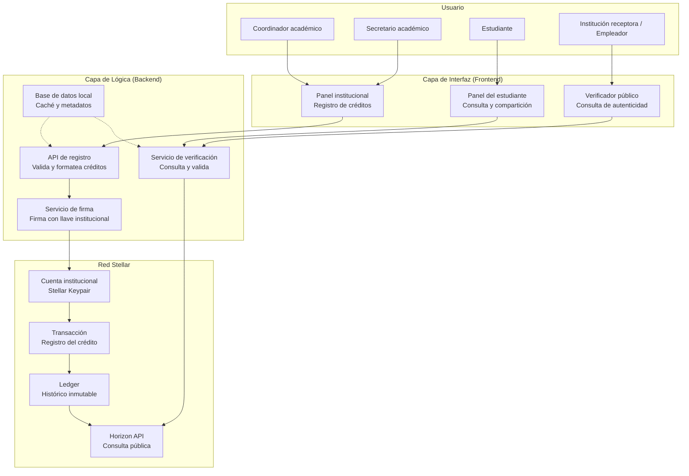

# Diagrama de conexión — Interfaz, Lógica y Stellar

## Tabla de capas

| Capa | Componente | Qué hace |
| :---: | --- | --- |
| **Interfaz** | Panel institucional | Registra créditos aprobados |
| **Interfaz** | Panel del estudiante | Consulta y comparte trayectoria |
| **Interfaz** | Verificador público | Confirma autenticidad sin contactar a la institución |
| **Lógica** | Servicio de firma | Firma créditos con llave institucional |
| **Lógica** | Servicio de verificación | Consulta el ledger para validar |
| **Stellar** | Ledger | Histórico inmutable de créditos |
| **Stellar** | Horizon API | Consulta pública para verificadores |