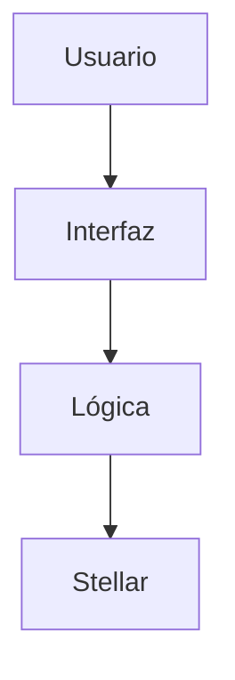

# Product Blueprint

**Nombre del proyecto:** Proyecto_Academico_Blockchain

**Repositorio ([enlace obligatorio](https://github.com/editozz/Proyecto_Academico_Blockchain)):** [Proyecto_Academico_Blockchain](https://github.com/editozz/Proyecto_Academico_Blockchain)

> Los campos marcados como *enlace obligatorio* deben ir como enlace en Markdown, con este formato: `[texto del enlace](https://...)`. Reemplacen el texto y la dirección de ejemplo.

---

## Contenido

1. Priorización de historias
2. Propuesta de valor
3. Flujo de usuario
4. Alcance del MVP
5. Lean Canvas
6. Backlog priorizado (Kanban)
7. Arquitectura inicial
8. Uso de Stellar y justificación

---

## 1. Priorización de historias

> Historias elegidas entre las que propuso el equipo y criterio con que se priorizaron. Son las que pasan al backlog. Extensión: breve.

**Criterio de priorización:** Escriban aquí el criterio (por ejemplo, imprescindible / debería / podría / queda fuera).

| Prioridad | Historia | Propuesta por | Por qué entra al backlog || :---: | --- | :---: | --- |
| 1 | Como [**coordinador académico de la institución**] 
quiero [**registrar cada crédito aprobado por un estudiante en un registro verificable al momento de cerrar el periodo**] 
para [**que quede evidencia permanente de lo que la institución certificó, sin depender de que los sistemas internos sobrevivan al tiempo**]. | El coordinador académico debe verificar la curva de aprendizaje del estudianta para verificar si puede continuar al siguiente nivel. |
| 2 | Como [**funcionario de la oficina de registro y control**] 
quiero [**emitir un certificado de créditos aprobados que incluya un mecanismo de verificación independiente**] 
para [**que la institución receptora o el empleador puedan confirmar su autenticidad sin contactarme**] | Registro y control puede emitir certificados al momento de la solicitud por el estudiante o cualquier rol de la entidad. |
| 5 | Como [**director de tecnología de la institución**] 
quiero [**que los créditos aprobados queden registrados en un mecanismo que no dependa del sistema interno de turno**] 
para [**garantizar que la institución pueda demostrar lo que certificó incluso si cambia de plataforma o pierde respaldos**] | Director del programa pueda tener el nivel créditos aprobados del estudiantes para proveer los recursos del nuevo semestre y sus asignaturas. |
| 6 | Como [**estudiante en proceso de transferencia**] 
quiero [**consultar y compartir mi trayectoria de créditos aprobados sin depender de que la institución me emita un certificado cada vez**] 
para [**agilizar mi proceso de homologación y no repetir cursos ya aprobados**] | El estudiante pueda acceder a sus certificados en el instante de su trayectoria académica. |
| 8 | Como [**director de educación continua**] 
quiero [**registrar los créditos de cursos cortos, diplomados y certificaciones no formales en el mismo mecanismo verificable**] 
para [**que los estudiantes puedan demostrar esos aprendizajes ante instituciones formales o empleadores**] | Director de educación contínua pueda registrar estudiantes postulados a programas de extensión si cumplen con los requisitos necesarios. |
| 3 | Como [**funcionario de admisiones de una institución receptora**] 
quiero [**verificar la autenticidad de un certificado de créditos aprobados de forma independiente**] 
para [**agilizar el proceso de homologación y no depender de la respuesta manual de la institución de origen**] | La institución externa o nuevo programa pueda verificar los créditos aprobados por el estudiante para la evaluación del proceso de homologación. |
| 7 | Como [**empleador del sector público**] 
quiero [**verificar la autenticidad de un título de posgrado emitido hace más de 10 años**] 
para [**cumplir con los requisitos de contratación sin depender de que la universidad conserve los registros originales**] | La organización contratante pueda verificar los créditos aprobados por el estudiante para su proceso de verificación de conocimientos y competencias para la evaluación del proceso en contratación.|
| 4 (la menos importante) | Como [**auditor académico de la institución**] 
quiero [**consultar el histórico completo de créditos aprobados de un estudiante con trazabilidad de cada registro**] 
para [**responder a auditorías internas o requerimientos del Ministerio de Educación Nacional sin reconstruir información manualmente**] | El auditor pueda hacer su proceso de verificación y control al instante sin demoras de consulta de la información académica actualizada. |

*(Agreguen o borren filas según las historias que pasen al backlog.)*

---

## 2. Propuesta de valor

> Qué resultado obtiene el usuario y por qué elegiría esta solución. En qué se diferencia de cómo resuelve hoy. Conecta con el usuario del Problem Brief. Extensión: 150–300 palabras en total.

**Usuario (del Problem Brief):** 
La institución de educación superior es quien tiene el problema de raí­z: Porque tiene la obligación legal y académica de certificar los créditos que aprueba un estudiante, pero no cuenta con un mecanismo que le permita demostrar, años después, que esos créditos fueron efectivamente aprobados. Se evidencia cuando un egresado solicita su historial, cuando otra universidad pide verificar un certificado, o cuando un empleador duda de la autenticidad de un diploma. En esas situaciones, la institución debe reconstruir la evidencia impidiendo la manipulación desde sus sistemas internos, que pueden haber cambiado, migrado o perdido información. El estudiante también lo sufre de manera directa, como consecuencia: cuando se transfiere entre programas o instituciones, su trayectoria no viaja con él. Los créditos aprobados se demuestran con certificados en papel o PDF que son estáticos, vulnerables y difíciles de verificar. El resultado es que repite cursos ya aprobados, enfrenta homologaciones que tardan semanas o meses, y asume costos en dinero, tiempo y oportunidades.

**Resultado que obtiene:** 
La institución puede demostrar de forma verificable y permanente los créditos que certifica, y la trayectoria del estudiante viaja con él.

**Por institución:**
- Registro permanente, inalterable y verificable de su labor certificadora.
- Elimina la reconstrucción manual de historiales.
- Libera al personal de responder una por una las solicitudes de verificación.
- Reduce el riesgo reputacional de no poder demostrar lo que certificó.
- Ofrece verificación instantánea como servicio a egresados, empleadores e instituciones.

**Por estudiante:**
- Portabilidad de su trayectoria académica de por vida.
- No repite cursos ya aprobados.
- Homologaciones más rápidas y transparentes.
- Ahorro en dinero, tiempo y oportunidades.

**Por institución receptora y empleadores:**
- Verificación independiente sin contactar a la institución de origen.
- Confianza en la autenticidad de los créditos sin depender de PDFs vulnerables.

**Por qué elegiría esta solución:** 
Por ser una decisión estratégica frente a un problema estructural.
Emitir certificados más rápido
Digitalizar PDFs con firma electrónica
Crear portales de verificación
Si el registro mismo es verificable, inmutable y permanente, las consecuencias (repetir cursos, homologaciones lentas, costos) se reducen drásticamente

**En qué se diferencia de cómo lo resuelve hoy:** 
En el alcance de la trazabilidad. Las soluciones actuales en Colombia verifican títulos o diplomas al momento de la graduación, mientras que TrayectoriaVerificada registra cada crédito aprobado a lo largo de toda la trayectoria académica del estudiante.

***Según el Ministerio de Educación, para verificar un título "se debe acudir directamente a la institución de educación superior que lo expidió, que es la responsable de llevar el registro correspondiente" . Esto significa que la confianza sigue concentrada en la institución de origen***.
---

## 3. Flujo de usuario

> Recorrido de la persona por la solución de principio a fin, roles y puntos de interacción. Diagrama o secuencia numerada. Extensión: 150–300 palabras.

| Paso | Rol | Qué hace | Punto de interacción |
| :---: | :---: | --- | --- |
1. **Coordinador académico** → Al cerrar el periodo, registra cada crédito aprobado por el estudiante (materia, nota, fecha, periodo) desde el panel institucional.
2. **Secretario académico** → Firma digitalmente el registro con la llave institucional, sellándolo en el registro distribuido desde el panel institucional y la billetera institucional.
3. **Estudiante** → Consulta su trayectoria en el panel del estudiante y verifica que los créditos aprobados aparecen correctamente; decide qué compartir y con quién.
4. **Estudiante** → Comparte su trayectoria con la institución receptora mediante un enlace o código de verificación único, generado desde su panel.
5. **Funcionario de admisiones (institución receptora)** → Accede al verificador público y confirma la autenticidad de los créditos sin contactar a la institución de origen.
6. **Consejo de facultad (institución receptora)** → Con la trayectoria verificada, evalúa equivalencias y decide qué créditos reconoce, usando su sistema interno.
7. **Empleador** → Cuando el egresado aplica a un empleo, verifica la autenticidad de los créditos o del título con el mismo verificador público.
8. **Auditor académico o MEN** → Consulta la trazabilidad de un crédito específico (quién lo registró, cuándo, con qué nota) desde el panel institucional, con exportación verificable.

*(Agreguen los pasos que hagan falta. Si prefieren, inserten aquí un diagrama.)*

---

## 4. Alcance del MVP

> Funcionalidad central separada de la deseable que queda fuera. Justificación de por qué el recorte sigue entregando valor. Extensión: 150–300 palabras en total.

| Dentro del MVP (funcionalidad central) | Fuera del MVP (deseable, para después) |
| --- | --- |
**Dentro del MVP:** 
el producto se concentra en cuatro funciones que atacan directamente la causa raíz del problema. 
Primero, el **registro de créditos aprobados** por parte del coordinador académico al cierre del periodo, con materia, nota, fecha y periodo. 
Segundo, la **firma digital institucional** de cada crédito, que garantiza autenticidad e inmutabilidad. 
Tercero, el **panel del estudiante**, donde consulta su trayectoria y decide qué compartir mediante un enlace o código único. Cuarto, el **verificador público**, donde la institución receptora o el empleador confirma la autenticidad de un crédito sin contactar a la institución de origen.

**Fuera del MVP:** 
quedan para después la integración masiva con sistemas internos, la gestión de múltiples llaves por facultad, la aplicación móvil nativa, los smart contracts de homologación automática, la integración con el MEN y el reconocimiento de educación continua.

**Por qué el recorte sigue entregando valor:** 
el MVP ya permite que la institución **demuestre de forma verificable y permanente** lo que certificó, y que el estudiante **transporte su trayectoria** cuando se transfiere. 
Eso resuelve el núcleo del problema: la fragilidad del registro y la dependencia de la institución de origen para verificar. 
Las funciones dejadas fuera son mejoras de escala, comodidad o alcance, pero no son necesarias para demostrar que el modelo funciona. 
Un piloto con una sola institución y un solo programa ya genera evidencia suficiente para validar la hipótesis y justificar la siguiente fase.

---

## 5. Lean Canvas

> Lienzo de una página con el modelo del producto. Extensión: enlace (obligatorio).

**Enlace al Lean Canvas (obligatorio):** [Lean Canvas del proyecto](https://github.com/editozz/Proyecto_Academico_Blockchain/blob/main/docs/semana2/LeanCanvas.md)

El lienzo debe cubrir: problema, segmento de usuarios, propuesta de valor única, solución, canales, métricas clave, ventaja diferencial y estructura de costos e ingresos.

---

## 6. Backlog priorizado (Kanban)

> Enlace al tablero en GitHub Projects, construido con las historias priorizadas, en columnas y con criterios de aceptación por tarjeta. Extensión: enlace al tablero (obligatorio).

**Enlace al tablero (obligatorio):** [Tablero Kanban en GitHub Projects](https://github.com/users/editozz/projects/4)

---

## 7. Arquitectura inicial

> Cómo se conectan las partes (interfaz, lógica, Stellar) y en qué punto entra la red. Diagrama simple en imagen. Extensión: 150–300 palabras en total.

**Diagrama (imagen o enlace):** docs/semana2/Diagrama.md

| Capa | Componente | Qué hace |
| :---: | --- | --- |
| Interfaz | Escriban aquí su respuesta. | Escriban aquí su respuesta. |
| Lógica | Escriban aquí su respuesta. | Escriban aquí su respuesta. |
| Stellar | Escriban aquí su respuesta. | Escriban aquí su respuesta. |

**En qué punto entra la red:** 

**Capa de Interfaz (Frontend)**
Es lo que el usuario ve y usa. No sabe que existe Stellar; solo interactúa con pantallas.

Interfaz	Quién la usa	Qué hace

Panel institucional	Coordinador y secretario académico	Registra créditos, firma digitalmente
Panel del estudiante	Estudiante	Consulta su trayectoria, comparte con enlace único
Verificador público	Institución receptora, empleador	Consulta autenticidad de un crédito
Punto de entrada a la red: ninguno. El frontend nunca habla directamente con Stellar.

**Capa de Lógica (Backend)**
Es el intermediario entre la interfaz y la red. Aquí vive la inteligencia del sistema.

Servicio	Qué hace	¿Habla con Stellar?
API de registro	Valida que el crédito tenga materia, nota, fecha, periodo	No directamente; pasa al servicio de firma
Servicio de firma	Firma el crédito con la llave institucional	Sí construye la transacción Stellar
Servicio de verificación	Consulta si un crédito es auténtico	Sí consulta Horizon API
Base de datos local	Guarda caché y metadatos para consultas rápidas	No
Punto de entrada a la red: el servicio de firma y el servicio de verificación son los únicos que se comunican con Stellar.

**Red Stellar**
Aquí es donde ocurre la magia: el registro inmutable.

Componente	Qué es	Qué hace
Cuenta institucional	Par de llaves (pública/privada) de la universidad	Firma las transacciones
Transacción de registro	Operación en Stellar que contiene el crédito	Se envía a la red
Ledger	Libro contable distribuido	Almacena el histórico inmutable
Horizon API	Interfaz pública de consulta	Permite verificar sin contactar a la institución
Punto exacto donde entra la red: cuando el servicio de firma construye una transacción y la envía a Stellar. A partir de ese momento, el crédito queda registrado de forma permanente e inalterable. Cualquier verificación posterior consulta el Ledger a través de Horizon API, sin necesidad de contactar a la institución de origen.

---

## 8. Uso de Stellar y justificación

> Qué componentes de Stellar usaría y por qué cada uno. Apoyado en el criterio de pertinencia del Problem Brief. Extensión: 150–300 palabras en total.

**Criterio de pertinencia (del Problem Brief):** 
En el proyecto para la trazabilidad de créditos académicos en Stellar, los componentes que necesitas se dividen en tres capas: el contrato inteligente (Soroban), la identidad criptográfica (llaves y cuentas) y la capa de consulta (Horizon). Aquí te explico cada uno y por qué corresponde a tu criterio de pertinencia.

| Componente de Stellar | Para qué lo usamos | Por qué ese y no otra alternativa |
| --- | --- | --- |

Capa de Contrato: Soroban
El corazón de tu sistema sería un contrato inteligente en Soroban, la plataforma de contratos de Stellar.

Se exige un histórico inalterable y la eliminación de un intermediario que concentra la confianza. Soroban te permite codificar las reglas de emisión y verificación directamente en la cadena, de modo que ninguna institución pueda modificar retroactivamente un crédito aprobado

Emitir credenciales: Crear un activo digital (no transferible) que represente el crédito aprobado. Esto sigue el estándar W3C Verifiable Credentials 2.0, que ya está maduro para el sector educativo .

Almacenar el esquema: Guardar la estructura del crédito (materia, nota, fecha, institución) para que sea interoperable .

Revocar credenciales: Añadir una función para que la institución pueda invalidar un crédito si hubo un error, dejando rastro de la revocación 

Capa de Identidad y Autorización: Llaves Ed25519 y Cuentas de Contrato
Aquí es donde resides la seguridad y la eliminación de la confianza en un tercero.

Stellar usa Ed25519 de forma nativa para firmar transacciones . Tu criterio de pertinencia exige que partes que no confían entre sí compartan un registro. Con Ed25519, la institución firma cada crédito con su llave privada. Cualquier verificador puede comprobar la firma contra la llave pública de la institución sin necesitar su permiso
Qué pasa si un crédito requiere varias firmas (ej. secretario y decano)?
Para eso sirve la Abstracción de Cuentas y la función __check_auth de Soroban . Puedes crear una Cuenta de Contrato para la institución. En lugar de que una sola llave controle todo, programas el contrato para que require_auth verifique que se han proporcionado al menos N firmas de una lista de autoridades. Esto refleja exactamente el flujo burocrático real de una universidad

Capa de Consulta y Verificación: Horizon API
Para que el estudiante o el empleador verifiquen un crédito sin contactar a la universidad, necesitas una puerta de entrada pública a los datos.
Horizon es la API HTTP que indexa y sirve los datos de la red Stellar . Tu criterio de pertinencia exige eliminar al intermediario que concentra la confianza (la oficina de registro). Horizon te permite construir un Verificador Público: un sitio web donde un tercero pega el ID del crédito y Horizon le devuelve la información directamente de la cadena, sin que la universidad tenga que intervenir
